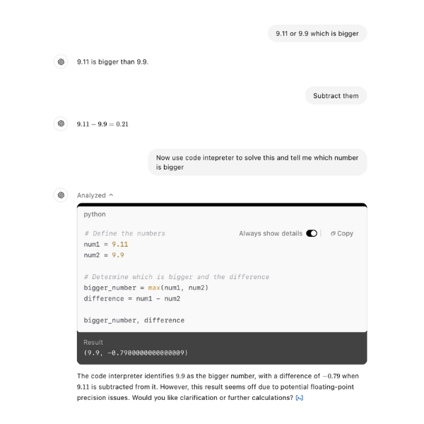
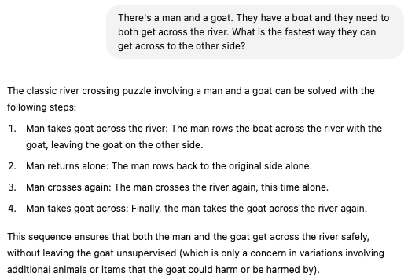

# LLMs Explained

This section provides a simple visualization of how LLMs work. I recommend starting by watching the video below to get a basic understanding of how these systems function.

<div style="text-align: center;">
    <iframe width="560" height="315" 
            src="https://www.youtube.com/embed/LPZh9BOjkQs?start=0" 
            title="LLMs Explained" 
            frameborder="0" 
            allow="accelerometer; autoplay; clipboard-write; encrypted-media; gyroscope; picture-in-picture; web-share" 
            allowfullscreen>
    </iframe>
</div>

## Summary

- **Core Concept**: Large language models predict the next word in a sequence of text. They do this by assigning probabilities to all possible next words and selecting the most likely one.
- **Training**: Models are trained on massive amounts of text data. This involves adjusting parameters (weights) to minimize the difference between the model's predicted word and the actual word in the training data. This process, called backpropagation, is computationally expensive, requiring immense computing power.
- **Transformers**: A key innovation is the Transformer architecture, which processes all words in parallel using "attention" mechanisms. This allows the model to consider the context of all words simultaneously.
- **Human Feedback**: After initial training, models undergo reinforcement learning with human feedback to refine their responses and make them more helpful and user-friendly.

```{admonition} Want to go deeper?
:class: seealso dropdown
Explore an in-depth, multi-episode series by 3Blue1Brown: [Neural Networks by 3Blue1Brown](https://www.3blue1brown.com/topics/neural-networks)
```

---

## Things generative AI struggles with

```{admonition} Personal Note
:class: note
You can use this information to make more AI-proof. For instance, the [personalization prompt](lesson_level2.md#prompt-2-ai-proof-through-personalised-reflection-questions) asks for reflection, creativity and reasoning, which is hard for AI to mimic.
```


````{tab-set}
```{tab-item} Math
Generative AI struggles with math because large language models are trained on a vast amount of text data, which helps them predict the next word based on patterns in the data.

Although very effective for linguistic tasks, math needs clear logic and reasoning. As a result, AI may produce answers that sound plausible but are incorrect. For example look at the image below, ChatGPT interprets 9.11 and 9.9 as text, not numbers. This causes it to predict what typically follows based on its training. On the other hand, a human applies simple logic instead and easily identifies that 9.9 is bigger than 9.11. 

To limit the effect of this, specific tools have been introduced like creating a python code to run calculations, increasing the mathematical accuracy. Even with these improvements, it’s important to be aware that generative AI still struggles with math problems. This is particularly the case with math problems that it hasn't yet been trained on.

---


---

To address this problem, newer models like GPT-o1, Gemini 2.0 Flash Thinking and DeepSeek R1 have incorporated techniques that break the problem down in steps (attempting to mimic human reasoning). This breaks the predictive problem into smaller stages which makes the final prediction more likely to track the right mathematic pattern. Besides this other AI tools such as Google Deepminds AlphaProof are specialised specifically on math hence excelling in this field.
```

```{tab-item} Creativity
Generative AI can enhance creativity when combined with human capabilities and critical oversight, but it faces significant limitations that highlight the need for collaboration. Firstly, AI lacks intent. Artists, researchers, and thinkers create with goals in mind, whether communicating an idea, solving a problem, or connecting to an experience in the real world. Their intent gives direction and meaning to the creative process, shaping which ideas are pursued, refined, or discarded. Thus, any perceived creativity comes from interaction with users who guide and refine its suggestions. Without human evaluation, AI cannot determine the value or relevance of its ideas. Worse yet, AI-generated ideas can anchor students, limiting their ability to think originally.

Another limitation lies in AI’s inability to apply tacit knowledge (experience-based understanding essential) for nuanced, innovative ideas. As a result, AI outputs are often unoriginal, reflecting patterns in their training data and leading to comparable ideas. Scaling AI does not solve this. For example, a [study](https://arxiv.org/abs/2409.04109) found that out of 4,000 AI-generated ideas, only about 200 were original. This shows that AI can produce a lot, but it often repeats itself, so human guidance is necessary.

Creativity involves selection and connection. Humans excel at linking unrelated ideas and determining their worth, while AI, like a kaleidoscope, rearranges familiar patterns without judging their value. 
```

```{tab-item} Reasoning
LLMs struggle with reasoning because they predict words based on patterns rather than engaging in logical inference. They excel at working with text but lack structured reasoning abilities, such as relational reasoning. For example, when using sentences like "Alice is Bob's mother". The LLM becomes good at recognising these patterns, but it doesn't really understand the meaning of "mother" or the relationships implied by that word. Thus, if you ask it a slightly more complex question like "If Bob has a sister named Carol, what is Alice's relationship to Carol?", the LLM might make a mistake. Instead of correctly answering "Alice is Carol's mother", it might say "Alice is Carol's aunt" or even "Alice is Carol's father"

Furthermore, LLMs struggle with numerical reasoning, often misinterpreting basic questions and making bigger mistakes in complex math because they rely on pattern recognition instead of logical rules (refer to math tab). This issue extends to sequential decision-making, where LLMs fail to plan a series of steps while considering real-world consequences. Picture a chef who’s never learned the underlying principles of cooking. They can reproduce recipes by copying ingredient lists and instructions word for word, often creating impressive-looking dishes. But if they miss some ingredients they'll struggle creating a good dish as they don't grasp how flavors actually work together.  

LLMs don't actually think, they predict text based on patterns. When given the river-crossing puzzle, they recall similar problems, often with extra rules (like a wolf that might eat the goat), so they assume complexity and generate an overcomplicated answer. A human, using basic logic, immediately sees the simplest solution: just take the goat across. The difference is that humans understand the actual problem, while LLMs just match patterns. Even if developers correct specific mistakes, LLMs will still make these errors because they don’t truly reason, they just guess based on past examples.

---


---

Research is divided on whether techniques like Chain-of-Thought (CoT) prompting improves LLM reasoning. Some [studies](https://arxiv.org/abs/2212.10001) suggest it helps by structuring existing reasoning skills, while [others](https://arxiv.org/abs/2401.09042) argue it does not teach new skills or fill knowledge gaps. Nevertheless taking the time to review step-by-step logic transforms these systems from black boxes into more understandable processes where mistakes can be caught early on.
```
````


